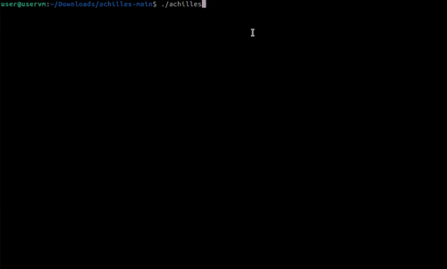
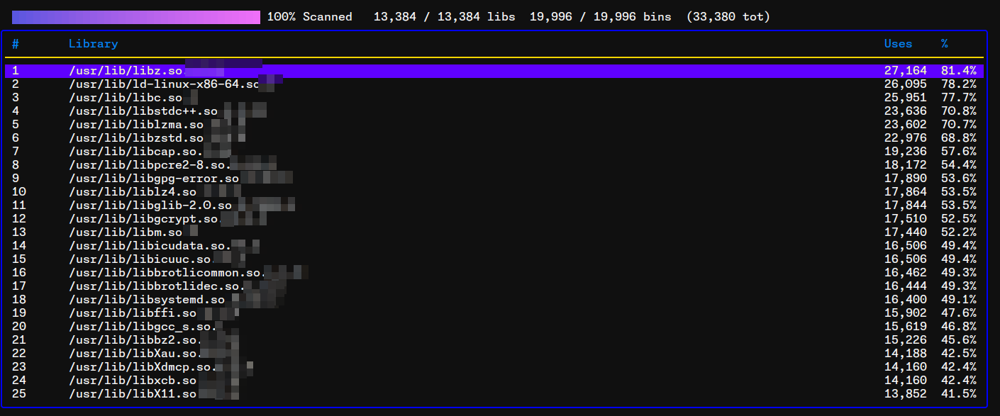

# Achilles

Find the achilles heel(s) of your system. Scans the libraries and binaries in your system,
determines which libraries they depend on, and lists the libraries in the order of most used to
least used.





## Running

Download one of the [releases](https://github.com/cocreators-ee/achilles/releases) as `achilles`,
then run:

```shell
chmod +x achilles
./achilles
```

`Esc`, `q`, or `Ctrl+C` quits, `Up`/`Down` or `j`/`k` to scroll up/down the table, `Home`, `End`,
`PgUp`, `PgDown` also work.

Or check out this repository and then run:

```shell
go run ./achilles.go
# or
go build -o achilles
./achilles
```

## Testing

You can also test this in a Docker environment

```shell
docker build . -t achilles
docker run --rm -it achilles
```

## License

The code is released under the BSD 3-clause license. Details in the [LICENSE](./LICENSE) -file.

# Financial support

This project has been made possible thanks to [Cocreators](https://cocreators.ee) and
[Lietu](https://lietu.net). You can help us continue our open source work by supporting us on
[Buy me a coffee](https://www.buymeacoffee.com/cocreators).

[](https://www.buymeacoffee.com/cocreators)
